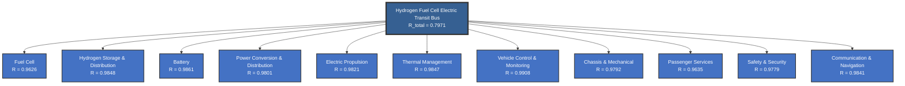
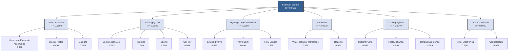
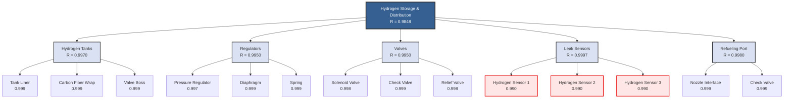

```mermaid
graph TB
    Bus[Hydrogen Fuel Cell Electric Transit Bus<br/>R_total = 0.7971]
    
    Bus --> FC[Fuel Cell<br/>R = 0.9626]
    Bus --> H2[Hydrogen Storage & Distribution<br/>R = 0.9848]
    Bus --> BATT[Battery<br/>R = 0.9861]
    Bus --> PWR[Power Conversion & Distribution<br/>R = 0.9801]
    Bus --> ELEC[Electric Propulsion<br/>R = 0.9821]
    Bus --> THERM[Thermal Management<br/>R = 0.9847]
    Bus --> VCU[Vehicle Control & Monitoring<br/>R = 0.9908]
    Bus --> CHAS[Chassis & Mechanical<br/>R = 0.9792]
    Bus --> PAX[Passenger Services<br/>R = 0.9635]
    Bus --> SAFE[Safety & Security<br/>R = 0.9779]
    Bus --> COMM[Communication & Navigation<br/>R = 0.9841]
    
    style Bus fill:#366092,stroke:#333,stroke-width:4px,color:#fff
    style FC fill:#4472C4,stroke:#333,stroke-width:2px,color:#fff
    style H2 fill:#4472C4,stroke:#333,stroke-width:2px,color:#fff
    style BATT fill:#4472C4,stroke:#333,stroke-width:2px,color:#fff
    style PWR fill:#4472C4,stroke:#333,stroke-width:2px,color:#fff
    style ELEC fill:#4472C4,stroke:#333,stroke-width:2px,color:#fff
    style THERM fill:#4472C4,stroke:#333,stroke-width:2px,color:#fff
    style VCU fill:#4472C4,stroke:#333,stroke-width:2px,color:#fff
    style CHAS fill:#4472C4,stroke:#333,stroke-width:2px,color:#fff
    style PAX fill:#4472C4,stroke:#333,stroke-width:2px,color:#fff
    style SAFE fill:#4472C4,stroke:#333,stroke-width:2px,color:#fff
    style COMM fill:#4472C4,stroke:#333,stroke-width:2px,color:#fff
```

```mermaid
graph TB
    FC[Fuel Cell System<br/>R = 0.9626]
    
    FC --> FCS[Fuel Cell Stack<br/>R = 0.9880]
    FC --> ASU[Air Supply Unit<br/>R = 0.9930]
    FC --> HSM[Hydrogen Supply Module<br/>R = 0.9960]
    FC --> HUM[Humidifier<br/>R = 0.9970]
    FC --> COOL[Cooling System<br/>R = 0.9940]
    FC --> DC1[DC/DC Converter<br/>R = 0.9940]
    
    FCS --> FCS1[Membrane Electrode Assemblies<br/>0.992]
    FCS --> FCS2[Bipolar Plates<br/>0.998]
    FCS --> FCS3[Gaskets<br/>0.999]
    
    ASU --> ASU1[Compressor Motor<br/>0.997]
    ASU --> ASU2[Impeller<br/>0.999]
    ASU --> ASU3[Casing<br/>0.999]
    ASU --> ASU4[Air Filter<br/>0.998]
    
    HSM --> HSM1[Solenoid Valve<br/>0.999]
    HSM --> HSM2[Valve Body<br/>0.999]
    HSM --> HSM3[Flow Sensor<br/>0.998]
    
    HUM --> HUM1[Water Transfer Membrane<br/>0.998]
    HUM --> HUM2[Housing<br/>0.999]
    
    COOL --> COOL1[Coolant Pump<br/>0.997]
    COOL --> COOL2[Heat Exchanger<br/>0.998]
    COOL --> COOL3[Temperature Sensor<br/>0.999]
    
    DC1 --> DC1A[Power Electronics<br/>0.996]
    DC1 --> DC1B[Control Board<br/>0.998]
    
    style FC fill:#366092,stroke:#333,stroke-width:3px,color:#fff
    style FCS fill:#D9E1F2,stroke:#333,stroke-width:2px
    style ASU fill:#D9E1F2,stroke:#333,stroke-width:2px
    style HSM fill:#D9E1F2,stroke:#333,stroke-width:2px
    style HUM fill:#D9E1F2,stroke:#333,stroke-width:2px
    style COOL fill:#D9E1F2,stroke:#333,stroke-width:2px
    style DC1 fill:#D9E1F2,stroke:#333,stroke-width:2px
```

```mermaid
graph TB
    H2[Hydrogen Storage & Distribution<br/>R = 0.9848]
    
    H2 --> HT[Hydrogen Tanks<br/>R = 0.9970]
    H2 --> REG[Regulators<br/>R = 0.9950]
    H2 --> VALV[Valves<br/>R = 0.9950]
    H2 --> LEAK[Leak Sensors<br/>R = 0.9997]
    H2 --> REF[Refueling Port<br/>R = 0.9980]
    
    HT --> HT1[Tank Liner<br/>0.999]
    HT --> HT2[Carbon Fiber Wrap<br/>0.999]
    HT --> HT3[Valve Boss<br/>0.999]
    
    REG --> REG1[Pressure Regulator<br/>0.997]
    REG --> REG2[Diaphragm<br/>0.999]
    REG --> REG3[Spring<br/>0.999]
    
    VALV --> VALV1[Solenoid Valve<br/>0.998]
    VALV --> VALV2[Check Valve<br/>0.999]
    VALV --> VALV3[Relief Valve<br/>0.998]
    
    LEAK --> LEAK1[Hydrogen Sensor 1<br/>0.990]
    LEAK --> LEAK2[Hydrogen Sensor 2<br/>0.990]
    LEAK --> LEAK3[Hydrogen Sensor 3<br/>0.990]
    
    REF --> REF1[Nozzle Interface<br/>0.999]
    REF --> REF2[Check Valve<br/>0.999]
    
    style H2 fill:#366092,stroke:#333,stroke-width:3px,color:#fff
    style HT fill:#D9E1F2,stroke:#333,stroke-width:2px
    style REG fill:#D9E1F2,stroke:#333,stroke-width:2px
    style VALV fill:#D9E1F2,stroke:#333,stroke-width:2px
    style LEAK fill:#D9E1F2,stroke:#333,stroke-width:2px
    style REF fill:#D9E1F2,stroke:#333,stroke-width:2px
    
    classDef redundant fill:#FFE6E6,stroke:#E60000,stroke-width:2px
    class LEAK1,LEAK2,LEAK3 redundant
```
